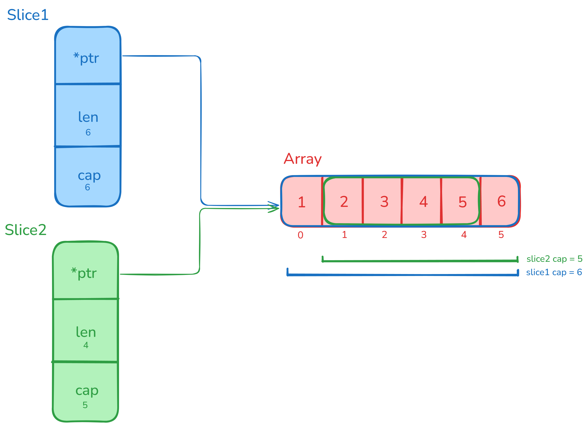

หากลอง Benchmark test ประสิทธิภาพ การใช้ Slice แบบไม่กำหนดความจุ (capacity) และ Slice ที่กำหนดความจุ

```go
package main

import "testing"

func BenchmarkNoPreAlloc(b *testing.B) {
	for b.Loop() {
		s := []int{} //ไม่กำหนดความจุ (capacity)
		for j := range 1000 {
			s = append(s, j)
		}
	}
}

func BenchmarkPreAlloc(b *testing.B) {
	for b.Loop() {
		s := make([]int, 0, 1000) //กำหนดความจุ (capacity)
		for j := range 1000 {
			s = append(s, j)
		}
	}
}
```

```bash
# ผลการรัน benchmark test ด้วย go test -bench=. -benchmem

Benchmark              | Iterations | Time/op     | Bytes/op    | Allocs/op           
---------------------------------------------------------------------------------------
BenchmarkNoPreAlloc-8     94048     | 13455 ns/op | 25208 B/op  | 12 allocs/op        
BenchmarkPreAlloc-8       805292    | 1429 ns/op  | 0 B/op      | 0 allocs/op
```

ผลการรัน test ออกมาคือ slice แบบกำหนดความจุ (pre-allocation) มีประสิทธิภาพในการใช้งานมากกว่าอย่างเห็นได้ชัด.<br>
สาเหตุมาจาก slice ในภาษา Go มีลักษณะเป็นสิ่งที่ใช้อ้างถึง array ภายใน (underlying array) อีกที ดังนั้นเมื่อมีความต้องการพื้นที่ภายในที่มากกว่าความจุเดิมที่มีอยู่<br>
การ re-allocate พื้นที่บนหน่วยความจำเพื่อสร้าง array ตัวใหม่ที่มีขนาดความจุมากพอ จึงเป็นสิ่งที่จำเป็น<br>
กระบวนการ re-allocate นี้นี่เอง ถ้าเกิดขึ้นบ่อยๆอาจบั่นทอนประสิทธิภาพของการใช้งาน slice ลงได้<br>
ดังนั้น การใช้งาน slice ให้มีประสิทธิภาพคือการกำหนดความจุของ slice ตั้งแต่ต้น.


```go
// slc1 และ slc2 ใช้ array ภายในตัวเดียวกัน

slc1 := []int{1,2,3,4,5,6}
slc2 := slc1[1:]
```