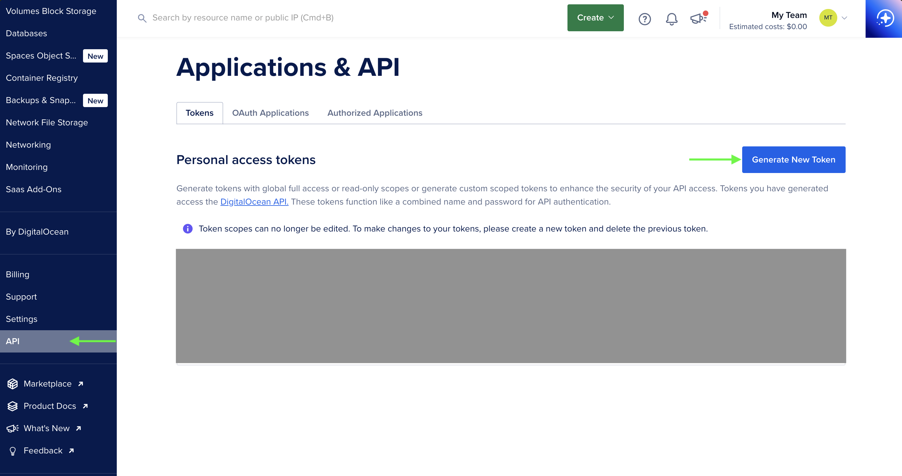
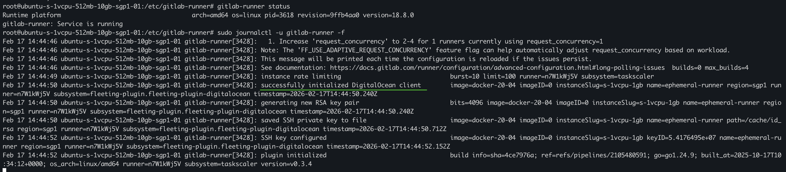

# บันทึกสิ่งที่ได้เรียนรู้จากการทำ Gitlab self-managed runners

## จุดเริ่มต้น
ผมเริ่มมองหาวิธีการทำ Self-managed Runners เพราะกำลังอยู่ในช่วงดีไซน์ระบบให้กับ Side Project ตัวหนึ่ง 
และส่วนสำคัญที่ขาดไปไม่ได้เลยใน Infrastructure ก็คือ CI/CD Pipeline ที่จะเข้ามาช่วย Automate งานต่างๆ หลังจากที่โค้ดถูก Push ขึ้นไปบน Repository แล้ว<br>
โดยปกติ GitLab เองจะมี Shared Runners มาให้ใช้ (ซึ่งเป็น Runner ตัวฟรี ที่นำ CI/CD pipeline ของหลายๆคนไปรันร่วมกัน) แม้ทาง GitLab จะแยก Environment ให้ก็จริง แต่ในแง่ของความปลอดภัย การที่ Source Code หรือ Logs สำคัญๆ ต้องไปรันอยู่บนที่ที่เราไม่ได้คุมเอง 100% ก็แอบน่ากังวลอยู่เหมือนกันสำหรับโปรเจคที่มีความสำคัญ<br>
ดังนั้น ไหนๆก็กำลังดีไซน์ ผมเลยลอง POC ทำ Self-managed Runner เองเลยดีกว่า.

ในการสร้าง Runner สิ่งที่สำคัญคือ การเลือก Executor ให้เหมาะสมกับ infastructure โปรเจคของเรา โดย Executor อาจเปรียบเสมือนเป็น 'Driver' ที่กำหนดว่างานใน Pipeline ของเราจะถูกรันด้วยวิธีไหน โดย GitLab มี Executor ให้เลือกใช้งานหลากหลายรูปแบบ อาทิ เช่น Docker, Kubernetes, Instance, Docker Autoscaler เป็นต้น

1. **Docker Executor** เป็น Executor ที่นำเอาเทคโนโลยี Container มาใช้ในการรัน CI/CD Jobs<br>
ข้อดี: คือการ Setup และการใช้งานนั้นตรงไปตรงมา ไม่ซับซ้อน<br>
ข้อเสีย: เนื่องจาก Container จะดึงทรัพยากร (CPU/RAM) มาจากเครื่อง Host โดยตรง ดังนั้นเราจึงจำเป็นต้องเตรียมสเปกเครื่อง Host ให้เพียงพอต่อความต้องการของ Runner<br>
หากจัดสรรสเปกไม่ดี หรือรัน Jobs พร้อมกันหลายตัวจนทรัพยากรเครื่อง Host ไม่พอ ก็อาจส่งผลให้ CI/CD Pipeline ล่มหรือทำงานช้าลงได้<br> และแน่นอนว่าการเช่า VPS สเปกสูงๆไว้ เพื่อรองรับโหลดงานหนักๆ ก็ย่อมมีค่าใช้จ่าย ที่สูงตามมาด้วยเช่นกัน เพราะ Cloud Provider ส่วนใหญ่คิดค่าใช้จ่ายเป็นรายชั่วโมง.

2. **Kubernetes Executor**: หาก Infrastructure ที่ผมดีไซน์ไว้มีการใช้ Kubernetes เป็น Base อยู่แล้ว ผมคงไม่ลังเลที่จะเลือกใช้ Executor ตัวนี้<br>
ข้อดี: คือความสามารถในการใช้ฟีเจอร์ Auto-scale ของ Kubernetes สร้าง Pods มารัน CI/CD Jobs ได้ตามต้องการ<br>
ข้อเสีย (ในบริบทของผม): คือความซับซ้อนในการ Setup เพราะผมไม่ได้ดีไซน์ที่จะใช้ Kubernetes Cluster สำหรับโปรเจกต์นี้ตั้งแต่ต้น การต้องมาเซต K8s Cluster เพียงเพื่อรัน Runner อย่างเดียวอาจจะดูเป็นการ 'ขี่ช้างจับตั๊กแตน' เกินไป

3. **Instance Executor**: เป็น Executor ที่ใช้วิธีสร้าง Instance (เครื่อง VM, VPS) ขึ้นมาใหม่เป็น Runner ชั่วคราว (Ephemeral Runner) เพื่อใช้รัน CI/CD Job โดยเฉพาะ<br>
ข้อดี: เป็นระบบแบบ Auto-scaling ที่ใช้ Fleeting library เพราะเครื่อง runner ชั่วคราว จะถูกสร้างขึ้นมาเมื่อมี CI/CD Job และทำลายทิ้งเมื่อรันเสร็จ วิธีนี้ช่วยควบคุมค่าใช้จ่ายได้ตามการใช้งานจริง ไม่ต้องมีเครื่อง Runner ไว้รอ CI/CD Jobs<br>
ข้อเสีย: เนื่องจาก Instance ที่ถูกสร้างขึ้นมามักจะเป็น Bare VPS (เครื่องเปล่า) การจัดการ Environment หรือติดตั้ง Dependency ต่างๆ ให้พร้อมใช้งานตามที่ Pipeline ต้องการนั้น ทำขาดความยืดหยุ่นพอสมควร เนื่องจากเครื่อง Runner จะต้องถูก Config ให้มี Environment ที่สามารถรัน Pipeline ได้ ก่อนเสมอ<br>
ยกตัวอย่างเช่น: หากใน Pipeline ของเราต้องการ Library ตัวเดียวกันแต่คนละ Version กัน การ Setup ลงบน OS ของ VPS โดยตรงจะค่อนข้างมีความซับซ้อน

4. **Docker Autoscaler Executor**: เป็น Executor ที่นำข้อดีของ Docker และ Instance Executor มาประยุกต์เข้าด้วยกัน โดยใช้ Fleeting Library ในการสร้าง Instance ที่มี Docker ขึ้นมาใหม่เป็น Runner ชั่วคราว (Ephemeral Runner)<br>
ข้อดี: คือการ Auto Scale Instance ขึ้นมาตามความต้องการของ CI/CD Jobs และใช้สามารถของ Docker มาใช้แยก Environment และ Dependency ของแต่ละ Job ได้อย่างอิสระ ทำให้เกิดความยืดหยุ่นสูง เพราะหน้าที่การ Setup dependency ของการรัน CI/CD อยู่ที่การเลือก Docker image ที่มี dependency ตามที่ต้องการใน CI/CD Pipeline แทน.<br>

<a id="fleeting-explain"></a>
>Fleeting คือ Library ที่ทำหน้าที่เป็นตัวกลางระหว่าง GitLab Runner และ Cloud Provider เพื่อจัดการเรื่อง Auto-scaling โดยเฉพาะ<br>
โดย Fleeting จะไม่ได้สื่อสารกับ Cloud Provider โดยตรง แต่จะใช้ Fleeting Plugin ซึ่งถูกรันขึ้นมาเป็น Sub-process ย่อยอีกที (หรือจะมองว่าเป็น API Server เล็กๆ ที่รอรับคำสั่งจาก Fleeting ก็ได้)


เมื่อเปรียบเทียบข้อดีและข้อเสียของแต่ละ Executor แล้ว ดูเหมือน Docker Autoscaler จะเป็นตัวเลือกที่ดีที่สุดสำหรับโปรเจคนี้ของผม.
## ปัญหา
หลังจากที่ผมตัดสินใจได้ว่า Docker Autoscaler Executor คือตัวเลือกที่ลงตัวที่สุด แต่เมื่อเริ่มลงลึกในรายละเอียดการติดตั้ง ผมกลับเจออุปสรรคสำคัญเข้าจนได้<br>
เพราะใน GitLab มี Fleeting Plugin รองรับให้เฉพาะ Cloud Provider เจ้าใหญ่ๆเท่านั้น เช่น AWS, Azure และ Google Cloud แต่สำหรับ Digital Ocean ที่เป็น Cloud Provider ระดับกลางๆและเป็น Cloud Provider ที่ผมเลือกใช้ เหมือนจะไม่มี Fleeting Plugin มาให้<br>
ในขณะที่ผมกำลังลังเลว่าจะยอมเปลี่ยนไปใช้ AWS หรือ Google Cloud เพื่อให้สามารถ Setup ง่ายๆได้ตาม document หรือไม่<br>
ผมก็ลองหาข้อมูลและทำความเข้าใจกับ Fleeting Library ไปด้วย แล้วก็พบว่า จริงๆ Gitlab มีเหตุผลที่ไม่ได้มี Fleeting Plugin มาคอย support ให้กับ Cloud Provider ทุกเจ้า เพราะก่อนหน้านี้ Gitlab เลือกใช้ [Docker machine](https://github.com/docker-archive-public/docker.machine) เป็นวิธีในการทำ Auto Scaling ให้กับ Runners <br>แต่เนื่องด้วยโปรเจค Docker Machine หยุดการพัฒนาไปและไม่มีการดูแลต่อ ทำให้ Gitlab ต้องมองหา solution ใหม่เข้ามาแทน จนเกิดเป็น Fleeting Library โดย Gitlab อะธิบายไว้อย่างละเอียดใน ['Next Runner Auto-scaling Architecture'](https://handbook.gitlab.com/handbook/engineering/architecture/design-documents/runner_scaling/)<br>
หลักการทำงานคร่าวๆของ Fleeting คือ การเป็น Interface ให้กับ Runner manager นั่นเอง
ยกตัวอย่างเช่น Runner manager เองไม่จำเป็นต้องรู้เลยว่าเราใช้ Cloud ของเจ้าไหนอยู่ แค่สั่งผ่าน Fleeting ว่าขอ Instance 3 ตัว มาเป็น Runner ย่อย (Ephemical runners) Fleeting จะเรียกใช้งานฟังค์ชั่น Increase(3) Cloud provider ต้องสร้าง Instance group มาให้ 3 ตัวพร้อมกับ IP Address แค่นั้นพอ.
นี่จึงทำให้ Fleeting มีความยืดหยุ่นค่อนข้างสูง.<br>
ดังนั้นการสร้าง Fleeting plugin ของ Digital Ocean จึงเป็น task ของฝั่ง Digital Ocean (Users) มากกว่าที่ต้องเขียน Plugin มา implement Interface ของ Fleeting<br>
แต่ก่อนที่ผมจะลงมือหา Document เขียน Fleeting plugin ของ Digital Ocean โชคดีที่ไปเจอว่า มีคนเขียนไว้ก่อนหน้าแล้ว [DigitalOcean Fleeting Plugin](https://gitlab.com/bearx3f/fleeting-plugin-digitalocean).

## ลงมือทำ
เมื่อหาข้อมูลพอสมควรแล้ว ทีนี้ก็เหลือแค่ลงมือทำ
โดยผมจะใช้
- **Digital Ocean** เป็น Cloud Provider
- **Gitlab** เป็น Source code Repository
- **Docker Autoscaler** เป็น Executor ของ Runner

ขั้นตอนการ Setup มีประมาณนี้
- เตรียม Gitlab Repository และ generate runner token ให้พร้อม.
- เตรียม Digital Ocean โดยสร้าง token สำหรับให้ Gitlab runner ใช้ในการติดต่อเพื่อทำ Auto scale.
- สร้าง VPS มาหนึ่งตัวเพื่อเป็น Runner manager ในการติดต่อกับ Gitlab Repository และติดต่อกับ Digital Ocean เพื่อสร้าง runners ชั่วคราว (Ephemical runners) มารัน CI/CD Jobs.
- Push โค๊ด เพื่อรัน CI/CD pipeline.

### เตรียม GitLab Repository

* **สร้าง Repository**: เริ่มต้นด้วยการสร้างโปรเจกต์สำหรับเก็บ Source Code และ CI/CD Pipeline ให้เรียบร้อย
* **สร้าง Runner**: ไปที่เมนู Settings 👉 CI/CD 👉 Runners, กดปุ่ม New project runner 👉 กำหนด Tag ให้กับ Runner เพื่อให้สามารถระบุในไฟล์ .gitlab-ci.yml ได้ว่า Job ไหนจะให้ Runner ตัวนี้เป็นคนรัน (เช่น my-project-1)<br>
**สำคัญ!** เก็บ Token หลังจากกด Create runner ให้คัดลอกและเก็บ Token ไว้ (เพราะ GitLab จะแสดงให้เห็นแค่ครั้งเดียว) token จำเป็นต้องใช้ในขั้นตอนการเชื่อม Runner Manager กลับมาที่ Gitlab Repository


### เตรียม Digital Ocean
* **สร้าง Digital Ocean API token** (แบบ Read/Write) เพื่อให้ Runner Manager ใช้ติดต่อกับ DigitalOcean ในการสร้างและลบ Ephemeral Runners อัตโนมัติ (Auto Scaling)<br>

* **สร้าง VPS สำหรับใช้เป็น Runner Manager**: แม้ตัว Runner Manager จะไม่ได้รัน Job เอง แต่ต้องคอยจัดการคิวการทำงานของ Ephemical Runners
ในการ POC ครั้งนี้ผมเลือกใช้ spec ที่ต่ำที่สุด แต่ในการทำงานจริง แนะนำ spec ขั้นต่ำที่ **1GB RAM (s-1vcpu-1gb)**
| Key | Value |
|---|---|
| Region | Singapore (sgp1) |
| Size | $4/month (s-1vcpu-1gb) |
| OS | Ubuntu (ubuntu-24-04-x64) |

### เซต VPS ให้เป็น Runner Manager
ssh เข้าไปใน VPS.

* **ติดตั้ง Docker** : สามารถทำตามขั้นตอนใน Official Document ได้เลย https://docs.docker.com/engine/install/ubuntu/<br>

* **ติดตั้ง GitLab Runner**
```sh
# Download the binary for your system (amd64)
sudo curl -L --output /usr/local/bin/gitlab-runner https://gitlab-runner-downloads.s3.amazonaws.com/latest/binaries/gitlab-runner-linux-amd64

# Give it permission to execute
sudo chmod +x /usr/local/bin/gitlab-runner

# Create a GitLab Runner user
sudo useradd --comment 'GitLab Runner' --create-home gitlab-runner --shell /bin/bash

# Install and run as a service
sudo gitlab-runner install --user=gitlab-runner --working-directory=/home/gitlab-runner

sudo gitlab-runner start
```

* **Compile ไฟล์ Fleeting Plugin Binary** : ต่อมา จำเป็นต้องมี ไฟล์ binary fleeting-plugin ของ digital ocean เนื่องจากที่ได้อธิบายไปในตอนต้นแล้วว่า gitlab runner ไม่ได้มี official fleeting plugin สำหรับ Digital Ocean มาให้ ดังนั้นจึงจำเป็นต้อง compile เองจาก Source Code ของโปรเจค [DigitalOcean Fleeting Plugin](https://gitlab.com/bearx3f/fleeting-plugin-digitalocean)<br>
```sh
export PACKAGE_REGISTRY_URL="https://gitlab.com/api/v4/projects/75321582/packages/generic/fleeting-plugin-digitalocean"

# รัน script install, หากติดปัญหา สามารถใช้วิธี manual clone repo และ compile source code สามารถดูรายละเอียดใน readme.md
curl -sSL https://gitlab.com/bearx3f/fleeting-plugin-digitalocean/-/raw/main/install.sh | bash
```

เมื่อแล้วเสร็จ ไฟล์ binary fleeting-plugin ของ Digital Ocean จะถูก compile ไว้ที่ path ```/usr/local/bin```


* **Config Runner Manager** : โดยสร้างไฟล์ ```config.toml``` ที่ path ```/etc/gitlab-runner/config.toml```
หากมีไฟล์อยู่แล้ว replace ทับไฟล์เดิมได้เลย, ใส่ token ทั้งจาก Gitlab Repository และ Digital Ocean ตามที่ได้เตรียมไว้ในขั้นตอนแรกลงไปในไฟล์.
```sh
# /etc/gitlab-runner/config.toml
concurrent = 4
check_interval = 3
connection_max_age = "15m0s"
shutdown_timeout = 0
[session_server]
session_timeout = 1800

    [[runners]]
        name = "DigitalOcean-Autoscaler-Runner"
        limit = 10
        url = "https://gitlab.com"
        token = "TOKEN-FROM-GITLAB" # 👈ใส่ token ที่ generate จาก Gitlab repository
        executor = "docker-autoscaler"
        shell = "sh"
        [runners.docker]
            tls_verify = false
            image = "busybox:latest"
            pull_policy = "if-not-present"
            privileged = true
            disable_entrypoint_overwrite = false
            oom_kill_disable = false
            disable_cache = false
            shm_size = 0
            network_mtu = 0
            network_mode = "host"
            volumes = ["/var/run/docker.sock:/var/run/docker.sock"]
        [runners.autoscaler]
            plugin = "/usr/local/bin/fleeting-plugin-digitalocean"

            capacity_per_instance = 2
            max_use_count = 10
            max_instances = 10
        [runners.autoscaler.plugin_config]
            access_token = "DIGITAL-OCEAN-TOKEN" # 👈ใส่ token ที่ generate จาก Digital Ocean
            image = "docker-20-04"
            instance_slug = "s-1vcpu-1gb"
            name = "ephemeral-runner"
            region_slug = "sgp1"
            ssh_private_key_file = "/cache/id_rsa"
            tag = "ci-runners"
        [runners.autoscaler.connector_config]
            protocol = "ssh"
            username = "root"
            keepalive = "10s"
            timeout = "10s"
            use_external_addr = false
        [[runners.autoscaler.policy]]
            idle_count = 0 # จำนวน ephemcal runner ที่เราสามารถคงไว้เป็น idle state สำหรับรัน CI/CD Job ได้ทันที
            scale_factor = 1.0
            idle_time = "5m0s"
            scale_factor_limit = 5
```

* เปลี่ยน owner และเซต permission ให้กับไฟล์ ```config.toml``` 
```sh
sudo chown root:root /etc/gitlab-runner/config.toml
sudo chmod 600 /etc/gitlab-runner/config.toml
```

* เริ่มรัน gitlab-runner
```sh
sudo systemctl start gitlab-runner
sudo systemctl enable gitlab-runner

# เช็คว่า gitlab-runner รันปกติและสามารถเชื่อมต่อกับ Digital Ocean ได้สำเร็จ
gitlab-runner status
sudo journalctl -u gitlab-runner -f
```
หากการเชื่อมต่อกับ Digital Ocean สำเร็จจะมี logs บอกสถานะการเชื่อมต่อขึ้นดังภาพ


เช็คที่หน้า gitlab repository จะสังเกตว่า ที่ runner มี status ขึ้นเป็น Online


หาก gitlab-runner (Runner Manager) รันได้ปกติ และสามารถเชื่อมต่อทั้ง 2 ฝั่งได้ เท่านี้ runner ก็พร้อมรับโหลด CI/CD Jobs มารันแล้ว. 

### เตรียม Source Code, CI/CD Pipeline และเริ่มรัน
เพื่อให้ครบ flow การทำงานทั้ง CI และ CD ผมจะสร้าง VPS อีกหนึ่งเครื่องเพื่อให้ runner เข้าไป deploy app
โดยใช้ Docker เป็น engine ครับ โดยสร้าง VPS แล้ว Access เข้าไป ติดตั้ง Docker.

ต่อมา ผมจะเตรียม CI/CD pipeline ที่เครื่อง Local เพื่อ push ไปยัง Gitlab Repository ที่เตรียมไว้

* สร้างไฟล์ ```Dockerfile```<br>
docker image ที่ผมเลือกใช้คือ http-https-echo ซึ่งเป็น Image ที่ใช้สำหรับตรวจสอบ Request ที่ส่งเข้ามา และ ตอบกลับด้วย ข้อมูลของ request นั้น

```docker
FROM mendhak/http-https-echo:latest

EXPOSE 8080
```

* สร้างไฟล์ ```.gitlab-ci.yml```
ในไฟล์นี้เราจะกำหนดให้ Pipeline มี 2 ขั้นตอนหลัก โดยอย่าลืมระบุ Tags ให้ตรงกับที่เราตั้งไว้ใน Runner (เช่นของผมกำหนด tag ด้วยชื่อ my-project-1)
```sh
stages:
  - docker_publish
  - deploy

default:
  image: docker:25
  tags:
    - my-project-1 # ใส่ชื่อ tag ให้ตรงกับที่สร้างไว้ในตอนต้น

# build image และ push ไปที่ GitLab Container Registry
docker_publish_image:
  stage: docker_publish
  script:
    - echo "--- Logging into GitLab Container Registry ---"
    - docker login -u $CI_REGISTRY_USER -p $CI_REGISTRY_PASSWORD $CI_REGISTRY
    - IMAGE_TAG=$CI_REGISTRY_IMAGE:$CI_COMMIT_SHORT_SHA
    - docker build -t $IMAGE_TAG .
    - docker push $IMAGE_TAG
  rules:
    - if: $CI_COMMIT_BRANCH == $CI_DEFAULT_BRANCH

deploy_to_droplet:
  stage: deploy
  image: alpine:latest
  script:
    - echo "--- Setting up SSH Access ---"
    - apk add --no-cache openssh-client coreutils
    - mkdir -p ~/.ssh
    # Using printf and -di to ensure the key is decoded perfectly
    - printf '%s' "$SSH_PRIVATE_KEY_B64" | base64 -di > ~/.ssh/id_rsa
    - chmod 600 ~/.ssh/id_rsa
    - eval "$(ssh-agent -s)"
    - ssh-add ~/.ssh/id_rsa
    - ssh-keyscan -H $TARGET_VPS_PRIVATE_IP >> ~/.ssh/known_hosts

    - echo "--- Deploying mendhak/http-https-echo to VPS ($TARGET_VPS_PRIVATE_IP) ---"
    - >
      ssh root@$TARGET_VPS_PRIVATE_IP "
        docker login -u ${CI_REGISTRY_USER} -p ${CI_REGISTRY_PASSWORD} ${CI_REGISTRY} &&
        docker pull ${CI_REGISTRY_IMAGE}:${CI_COMMIT_SHORT_SHA} &&
        docker stop my-echo-app || true &&
        docker rm my-echo-app || true &&
        # Note: Port 8081 on VPS -> Port 8080 inside the container
        docker run -d --name my-echo-app \
          -p 8081:8080 \
          --restart unless-stopped \
          ${CI_REGISTRY_IMAGE}:${CI_COMMIT_SHORT_SHA}
      "
  dependencies:
    - docker_publish_image
  rules:
    - if: $CI_COMMIT_BRANCH == $CI_DEFAULT_BRANCH
```

* ก่อนที่ จะ push โค๊ดไปที่ repo ผมจะ config ให้ repo มี secrets ต่างๆที่ต้องใช้ตามที่ระบุใน Pipeline โดยเข้าไปที่เมนู CI/CD > Variables
| Key | Description |
|---|---|
| TARGET_VPS_PRIVATE_IP | Pubic IP ของเครื่อง Deploy |
| SSH_PRIVATE_KEY_B64 | ssh private key (encode base64) |

เมื่อ Push code ขึ้นไปยัง Repository จะสังเกตได้ว่า Runner ของเราขึ้นสถานะทำงาน โดยมีการรัน pipeline เกิดขึ้น เราสามารถเข้าไป monitor logs ได้จาก เมนู Pipeline


สุดท้าย ผมลอง access vps deployed app ว่า app ถูก deploy ขึ้นจริงๆ โดยใช้ ip ของ เครื่อง vps


## สรุป
ผมได้เรียนรู้และเข้าใจ การทำงานของ Runner ในหลายมิติ ตั้งแต่ความเข้าในการทำงานเบื้องต้นของ runner, การทำงานภายในของ runner และความเป็นมาของ library ที่สำคัญของ Gitlab runner นั้นก็คือ fleeting.

[^runner]: runner คือ agent ที่ execute หรือรัน ci/cd jobs ใน pipeline
[^executor]: executor คือ รูปแบบและเครื่องมือ ที่ใช้ในการรัน ci/cd jobs
[^ephemical-runner]: ephemical runner คือ runner ย่อย/เล็กๆ ที่ถูกสร้างขึ้นมาชั่วคราวเพื่อรัน job เมื่อรันเสร็จจะถูกลบออกไป